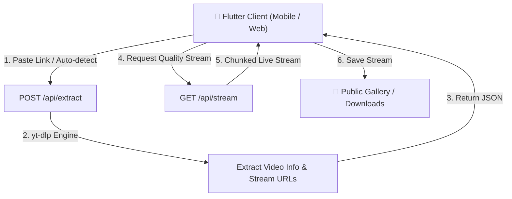

# ⚡ QuickSave — Universal High-Speed Media Downloader

<p align="center">
  
</p>

<p align="center">
  <strong>Blazing-fast, modern, zero-telemetry multi-platform video & audio downloader.</strong><br>
  Built with <strong>Flutter (Dart)</strong> for cross-platform UI and <strong>FastAPI (Python + yt-dlp)</strong> for high-throughput stream extraction.
</p>

<p align="center">
  
  
  
  
  
  
  
</p>

<p align="center">
  <a href="https://github.com/Ranit111/quicksave-video-downloader/releases/latest">
    
  </a>
</p>

---

### 📥 Direct APK Downloads

| Architecture | Download Link | Target Devices |
| :--- | :--- | :--- |
| **ARM64 (64-bit)** | [⬇️ `QuickSave-v1.0.0-arm64-v8a.apk`](https://github.com/Ranit111/quicksave-video-downloader/releases/download/v1.0.0/QuickSave-v1.0.0-arm64-v8a.apk) | **Recommended** for modern phones (Xiaomi, Samsung, Pixel, OnePlus, Vivo, Oppo, Realme) |
| **ARMv7 (32-bit)** | [⬇️ `QuickSave-v1.0.0-armeabi-v7a.apk`](https://github.com/Ranit111/quicksave-video-downloader/releases/download/v1.0.0/QuickSave-v1.0.0-armeabi-v7a.apk) | For older 32-bit Android smartphones |
| **x86_64** | [⬇️ `QuickSave-v1.0.0-x86_64.apk`](https://github.com/Ranit111/quicksave-video-downloader/releases/download/v1.0.0/QuickSave-v1.0.0-x86_64.apk) | For Android Emulators & Chromebooks |
| **All Releases** | [📦 View All Assets on GitHub Releases](https://github.com/Ranit111/quicksave-video-downloader/releases/tag/v1.0.0) | Full release notes and checksums |

---

## ✨ Features

- 🌐 **Universal Platform Support**: Extract high-resolution media from **YouTube**, **Facebook (Reels & Videos)**, **Instagram (Reels, Posts, IGTV)**, **TikTok**, **X / Twitter**, **ShareChat**, **Reddit**, and 1000+ websites.
- 🚀 **High-Speed Direct Stream Proxy**: Streams directly from origin CDNs to the client in chunked transfer mode with zero temporary disk usage on the backend server.
- 🎯 **Multi-Quality 2x2 Grid**: One-tap selection for **4K UHD**, **1080p FHD**, **720p HD**, **360p SD**, and **MP3 / M4A Audio-only**.
- 🎬 **Zero-AI Related Videos Engine**: Instant related content recommendations based on tokenized metadata extraction with full multilingual (Unicode) query support.
- 📱 **Android Scoped Storage Ready**: Saves downloads directly to public `/storage/emulated/0/Download` without requiring invasive storage permissions.
- 🎨 **Dark Cyberpunk Glassmorphism UI**: Custom frosted glass components, glowing gradient accents, responsive touch interactions, and real-time download progress + speed tracker.
- 🛡️ **Hardened Backend Security**:
  - **SSRF Defense**: Strict CDN domain allowlist and automatic RFC 1918 private IP range filtering.
  - **Memory Safeguards**: Response size bounds and MIME-type validation on proxy endpoints.
  - **Stream DoS Protection**: 3-hour duration ceiling and automated partial file cleanup on cancel or interruption.

---

## 🏗️ Architecture



---

## 📁 Repository Structure

```
├── backend/
│   ├── app/
│   │   ├── main.py            # FastAPI entrypoint, proxy endpoints, security filters
│   │   ├── extractor.py       # yt-dlp extraction logic & size calculator
│   │   ├── models.py          # Pydantic request/response schemas
│   │   └── related_service.py # Zero-AI related videos recommendation engine
│   ├── Dockerfile             # Containerized deployment spec
│   ├── requirements.txt       # Python dependencies
│   └── test_extractor.py      # Pytest test suite
│
├── mobile_app/
│   ├── lib/
│   │   ├── core/              # Theme, constants, cyber colors
│   │   ├── models/            # Dart data models (VideoInfo, QualityOption)
│   │   ├── providers/         # State management (DownloaderProvider)
│   │   ├── services/          # API & gallery download services
│   │   ├── utils/             # Error formatters & helpers
│   │   ├── views/             # HomeScreen, SplashScreen
│   │   └── widgets/           # GlassContainer, QualityGrid, PreviewCard, etc.
│   ├── test/                  # Flutter unit and widget tests
│   └── pubspec.yaml           # Flutter dependencies
│
├── run.bat                    # Start backend and web frontend together
├── run_mobile.bat             # Start backend and mobile app on device
├── run_web.bat                # Start backend and web version in browser
└── README.md
```

---

## 🚀 Getting Started

### 1. Prerequisites
- **Python 3.10+** (with `pip`)
- **Flutter SDK 3.x+**
- **FFmpeg** installed and accessible in your system `PATH`

---

### 2. Backend Setup

```bash
# Navigate to the backend directory
cd backend

# Create and activate a virtual environment
python -m venv .venv
# On Windows:
.venv\Scripts\activate
# On Linux / macOS:
source .venv/bin/activate

# Install dependencies
pip install -r requirements.txt

# Start FastAPI server
uvicorn app.main:app --host 0.0.0.0 --port 8000 --reload
```

Backend health check will be live at `http://localhost:8000/health`.

---

### 3. Frontend Setup (Flutter)

```bash
# Navigate to the mobile_app directory
cd mobile_app

# Fetch dependencies
flutter pub get

# Run on Chrome / Web
flutter run -d chrome

# Run on connected Android device / emulator
flutter run
```

---

### 4. Quick Launch Scripts (Windows)

For single-click local execution, batch scripts are available at the root:

| Script | Action |
|---|---|
| `run.bat` | Launches FastAPI backend + Flutter Web simultaneously |
| `run_mobile.bat` | Launches FastAPI backend + Flutter Android App |
| `run_web.bat` | Launches backend and opens QuickSave in Chrome |

---

## 📡 API Reference

### `POST /api/extract`
Extracts available stream formats, resolutions, thumbnail, and related metadata.

**Request Body:**
```json
{
  "url": "https://www.youtube.com/watch?v=dQw4w9WgXcQ"
}
```

**Response (200 OK):**
```json
{
  "id": "dQw4w9WgXcQ",
  "title": "Rick Astley - Never Gonna Give You Up (Official Music Video)",
  "thumbnail": "https://i.ytimg.com/vi/dQw4w9WgXcQ/maxresdefault.jpg",
  "duration": 213,
  "duration_formatted": "03:33",
  "platform": "youtube",
  "platform_name": "YouTube",
  "qualities": [
    {
      "format_id": "1080p",
      "resolution": "1080p",
      "quality_label": "1080p (FHD)",
      "ext": "mp4",
      "filesize_bytes": 45123456,
      "filesize_formatted": "43.0 MB",
      "is_audio_only": false
    },
    {
      "format_id": "audio",
      "resolution": "Audio",
      "quality_label": "Audio (MP3)",
      "ext": "mp3",
      "filesize_bytes": 3512345,
      "filesize_formatted": "3.3 MB",
      "is_audio_only": true
    }
  ],
  "related_videos": []
}
```

### `GET /api/stream`
Proxies media chunks directly from origin servers with custom `Range` headers.

**Query Parameters:**
- `url`: Original media URL
- `format_id`: Desired format identifier (e.g. `1080p`, `720p`, `audio`)
- `ext`: Target file extension (`mp4`, `mp3`, `m4a`)
- `is_audio`: Boolean flag (`true` / `false`)

---

## 🧪 Testing & Verification

### Running Backend Tests
```bash
cd backend
pytest
```

### Running Flutter Tests
```bash
cd mobile_app
flutter analyze
flutter test
```

---

## 🔒 Security & Privacy Notice
- QuickSave does not store downloaded files or logs on the server.
- All media queries are processed in memory and streamed directly to the requesting client.
- Please ensure you comply with the Terms of Service of content platforms and relevant copyright laws.

---

## 📄 License
This project is open-source under the [MIT License](LICENSE).
